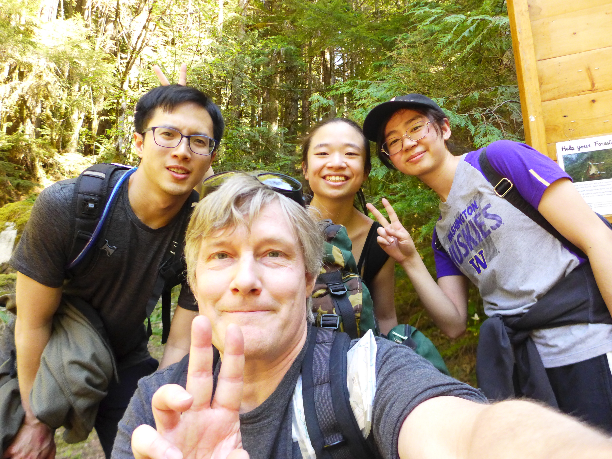
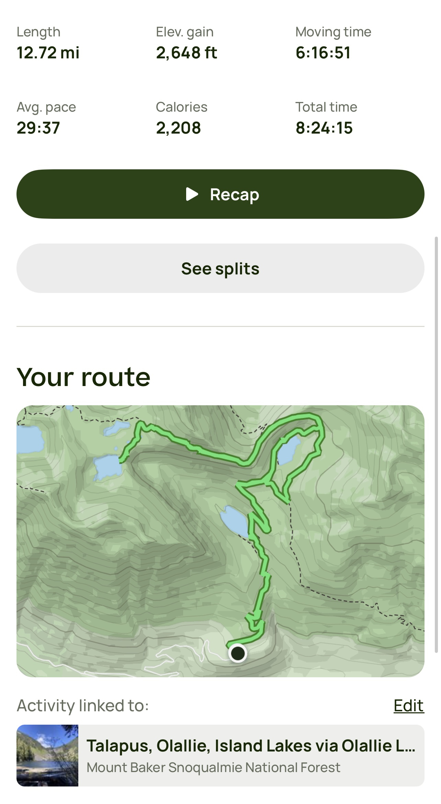

# Hi

So I wanted to start this because I've always felt like there's this need to document everything, make a list of everything, and have them organised. My natural instinct is more or less to dump my brain's contents, which is usually just chaotic, but I also feel this need to have stuff organised so half the time I'm battling between trying to get all my thoughts down and trying to organise stuff properly.

Anyways. Yeah, I've named this monologue cause it's more or less just me stream-of-conscious dumping shit in here but hopefully, ORGANISED. Also I had no idea people usually don't have a list of everything in their life. Oops. I guess I'm psychotic enough to have a list of all the books I have on my shelf (371 and counting), and I have a master list of lists (a non-exhaustive lists of lists given I have some on my lists scribbled on 10 different notebooks and like, 10 different apps at this point).

Annnnd I just deployed this to GitHub pages which probably isn't a great idea because everyone can see it and tie it back to me (I don't want to pay $49/year to have a private repo) but I assume no one's interested enough in me to be reading this... so hi if you actually made it this far. I promise you, I'm normal (enough).

So here's the stuff I eventually want to have on this... brain dump page. Not sure if I'll even keep up with this but hereeee we go. 

Forewarning: this is pretty much JUST for me. I might have BAD recommendations cause it's tailored for ME. Do not trust my taste. I enjoy eating ***boiled*** bok chow. Straight up over-boiled soggy boy choy. And yes, I prefer it over the stir fried version.

- Book, film/tv, food/recipes/(restaurants), music/band/artist, country_recs(th/tw/sea) list
- Book review

# Table of Contents
1. [Books](#booksection)
2. [Seattle section](#seattlesection)
3. [Beer](#beersection)
4. [Recipes](#recipesection)
5. [Hiking Spots](#hikingsection)

---

# Book Section 

## Book reviews

#### List:
1. [Agua Viva by Clarice Lispector](#bookreview-aguaviva-lispectorclarice)
2. [Funny Story by Emily Henry](#bookreview-funnystory-henryemily)

### Agua Viva by Clarice Lispector 
**Genre:**

**Read date:**

**Rating:**

**Review:**

### Funny Story by Emily Henry 
**Genre:** Romance

**Read date:** 2024-sometime

**Rating:** 1/5

**Review:**

I would’ve chucked this book out of my room—like how Daphne chucks her dad’s gifts—if it weren’t for the fact that I read this on my laptop.

I’m going to divide this review into a spoiler-free section and another that’s riddled with spoilers because there’s a lot to unpack...

Fair warning; take my review with a grain of salt. I dislike romance novels that hinges on miscommunications and insecurities. It’s not to say that adults don’t have their insecurities and this doesn’t happen in real life, but this just feels like a teenage romance novel. I just want ONE healthy romance book where relationship issues stem more from incompatibility, or some the-world-cucks-you-two event (uhh, COVID?). If anyone has recommendations, please throw it my way.

So here’s the spoiler-free section

The only thing that held the novel together was banter—the novel started off great, but that’s because it’s just mostly banter mixed with fun internal commentary (Project Hail Mary still takes the cake for wit though). The more you get to know the characters, the more disappointing the book becomes. They’re all fairly formulaic, which isn’t a big deal in a sense, but with Pride & Prejudice and The Seven Husbands of Evelyn Hugo being my more recent romance reads, I had higher expectations for the female lead. I don’t mind mildly toxic characters if they’re aware or just on a self-destructive path.

There are a few cute scenes here and there. I still liked Miles (the one character I would consider more redeemable writing-wise... but more on that in the spoilers section) enough that it made me smile (Miles, smile. Hah). The scene where Daphne’s dying after what Miles would probably consider light exercise made me feel very validated :))

I probably only finished this book because I fell for the sunken cost fallacy. Oops. 

So onto the spoiler-y section and why I feel taking like reading a shampoo bottle label while taking a shit would’ve been more fun.

SPOILER-Y SECTION

The crux of the issue: Daphne. 

A recurring thought Daphne has is that she regrets building her life around Peter. She moves to Waning Bay because of him, and she’s ready to leave the second they break off their engagement. Dating Miles makes her hesitate to leave, but then the misunderstanding with Miles leads her to wanting to leave again. The misunderstanding gets cleared up, and she stays??? 

You can’t tell me she stayed because she found a community there. She pretty much tells Ashleigh and Mile she’s leaving. Clearly, her best friend and her library job wasn’t what made her stay. She stayed over a rebound that she’s known for THREE months (Chapter 3 is on May 18th, they’re still clearly friendly housemates here; Chapter 37 is when she decides whether to stay or leave).

She’s also very insecure. Makes sense, given her upbringing, but the constant need to victimize herself gets exasperating. At some point Miles says Peter cheated because “...as soon as someone starts to figure you out—as soon as you can’t be perfect—it’s easier to move on”,  she somehow draws the conclusion “So that’s it?” My voice crackles. “I make people feel like their worst selves.” . 

There’s also constant self pity: “Maybe certain people are destined to be solitary creatures. Maybe no matter how hard I try, I’ll end up back here”. You need some serious self-love, ma’am. You’re a librarian, at the very least I’m sure there’s self-help books for you out there.

I also found it odd that she was with Peter for 3 years, was engaged to this fucking guy, and does not mention at all one good trait about him. Stability is probably the only positive character trait—the rest is literally just ‘silver spoon golden boy picture perfect family’. Oh he a great cook but he doesn’t have the patience to teach me how to cook. Oh we used to hike and his body’s perfect but he’s inconsiderate makes me feel bad about being slow. There’s no real miss-you-for-something-positive. Her pining for him? All laden with “PRICK” across his forehead. YOU WERE READY TO MARRY HIM. It just occurred to you that he’s a dick???

Miles’ character started off really well. I wanted to know more about his relationship with his sister and his family, and we got to explore some of that but even then, it felt... shallow. It was more tell-than-show. I think they could’ve explored his trauma more; I know he’s kind of emotionally blunted, but we never really get to see him phased by anything aside from that “I love you” bomb (again: rebound, three months. I’m a cynic).  But hey, I’m no therapist.

The author also decided that this very thoughtful guy, who knows Daphne has abandonment issues, will flake on her without prior communication. Yes, you did it to help her with her daddy-abandonment-issues, blah, it’s noble, but really, did it not occur to you that you’re doing exactly what the dad is doing? You ask her to talk afterwards, drop the love bomb, and she literally tells you that she trusted you, and you don’t take the opportunity to just fess up that you were trying to help her? Had the dad or Julia not said anything, Daphne’s abandonment issues would’ve exacerbated and they wouldn’t have gotten back together. He could’ve texted that he was helping Petra—that’s significantly better than just completely disappearing. It’s the ex, but Daphne would’ve eventually found out either way. It’s also within his personality to help a cheating ex if they’re struggling, so I don’t think Daphne would’ve been as worried as the random ghosting.

Two more things to nitpick on:

(1) Sadie didn’t have to pick a side. Ride-or-die friends are a thing but you still don’t have to pick sides. Unless you have the emotional intelligence of a kindergartener. And if my best friend did that to me, I wouldn’t waste my time being friends.

(2) I wanted to be vindicated when Peter and Petra eventually break off their engagement but alas, scene fell flatter than flat earth-ers think the earth is. It was literally, “I did an oopsie” - Peter. This guy’s legit cardboard. You cannot get more stock character-y than that.

So yeah, I now understand why people burn books.

---

# Seattle Section 

## Restaurant recommendations
- Taco Chukis
- Pho Bac
- Shambles (beef; weirdly this has an asian flavouring to it)
- Mioposto

### Lynnwood
- Chops
- Kim's Teriyaki

---

# Beer list 

---

# Recipe list 

## want to make
- ?

## made before (dump)
- [[JustOneCookbook] Japanese Strawberry Shortcake](https://www.justonecookbook.com/japanese-strawberry-shortcake/) -- note substitutes later
- [[Joshua Weissman] Caneles](https://www.joshuaweissman.com/post/french-pastry) -- note substitutes later.
- [Cream Puffs](https://www.youtube.com/watch?v=3xtSr5iIuTo&ab_channel=%EC%8B%9D%ED%83%81%EC%9D%BC%EA%B8%B0tablediary)
- [[NYT] Gojuchang Caramel Cookies](https://cooking.nytimes.com/recipes/1023675-gochujang-caramel-cookies)
- [[HotThaiKitchen] Larb](https://hot-thai-kitchen.com/laab-moo/) -- note substitutes. Oh and ACTUALLY ADD CULANTRO it's good! I apparently forgot to read the recipe properly (:

---

# Hiking spots (I've been to) 

## WA
- [Poo poo point]
- [uhhh some hike with the dude? The one that went up? Was it Martin??? And there was a bunch of rocks? Or is this iron goat O-O]
- [? the one where tot led us astray. W/ jaimie/hunter/binn]
- [? the one w the crew]
- [20230514 @ the one w/ natt+jaimie]

- [Otter Falls]
- [20220614 @ Iron Goat Trail]

- [Talapus / Ollalie / Island Lake](https://www.alltrails.com/trail/us/washington/talapus-olallie-island-lakes-via-olallie-lake-island-rainbow-trail): 12.72miles, 2648ft elevation gain, 6:16 moving time 8:24 total time. This one killed my knees for a month (couldn't go up and down the stairs without immense sharp stabby knee pain). I had to take Ott's walking stick and he's like, 50. Oops.

---
Knee

?
- cold/hot flashes at parts

20241028
- kneecap tight
- buzzing
- cold hot flashes throughout leg
- leg going numb
